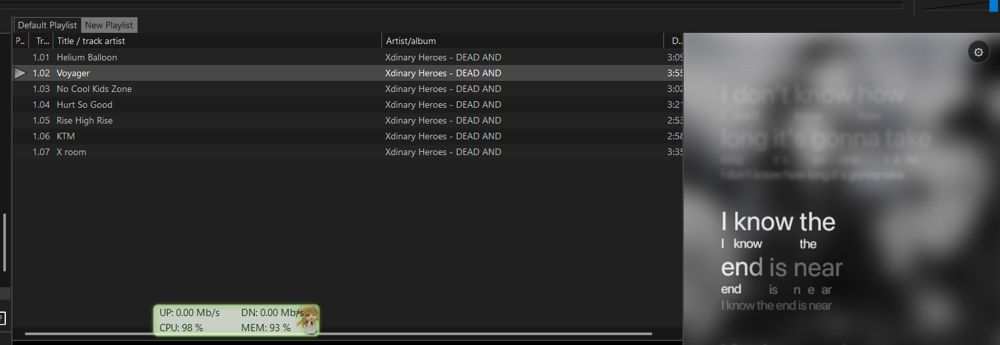

# AMLL foobar2000 Panel

An Apple Music-like synchronized TTML lyrics panel for foobar2000, built with
[`@applemusic-like-lyrics`](https://github.com/amll-dev/applemusic-like-lyrics)
and hosted through `foo_uie_webview` / WebView2.



## Requirements

- Windows 10 or later
- foobar2000 2.x
- [foo_uie_webview](https://github.com/stuerp/foo_uie_webview/releases)
- Microsoft Edge WebView2 Runtime
- Sidecar `.ttml` lyrics with the same basename as the audio file

## Current features

- Word-by-word TTML lyrics with click-to-seek
- Sidecar `.ttml` loading from the playing track folder
- Automatic lyric and artwork updates on track changes
- Blurred album-art background
- SF Pro font support when installed on Windows
- Live brightness, opacity, blur, and lyric-size controls
- Translation and romanization visibility toggles without reloading lyrics

## Build

```bash
npm install
npm run build
```

The build creates a standalone `index.html` with its JavaScript and CSS embedded.
`embed-dist.mjs` also copies it to the configured local output locations.

In the WebView component preferences, enable **Read files** so the panel can read
sidecar TTML files and external artwork.

## Documentation

- [Development guide](DEVELOPMENT.md)
- [Architecture and runtime flow](ARCHITECTURE.md)
- [Known issues and invariants](KNOWN_ISSUES.md)
- [Changelog](CHANGELOG.md)
- [Roadmap](ROADMAP.md)

This repository contains a WebView template, not a native foobar2000 component.
End users still need `foo_uie_webview` and Microsoft Edge WebView2.

## Download

Download the ready-to-use ZIP from [GitHub Releases](https://github.com/alfarisauliarahman/amll-foobar2000-panel/releases).
No Node.js installation is required for the release build. See [INSTALL.md](INSTALL.md).

## Font

SF Pro is used when it is already installed on Windows. The Apple font file is
not redistributed. Systems without SF Pro automatically fall back to Segoe UI.

## License

This project is licensed under [GNU AGPL v3](LICENSE) because its distributed
standalone build incorporates AGPL-licensed AMLL packages. See
[THIRD_PARTY_NOTICES.md](THIRD_PARTY_NOTICES.md).
